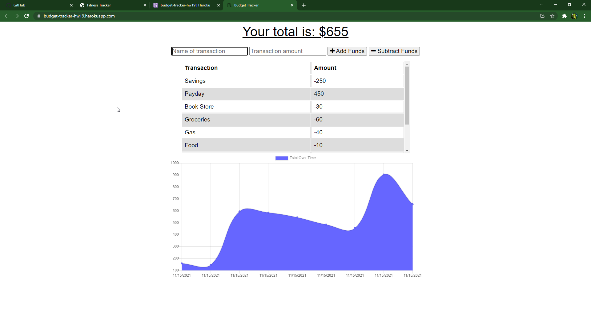

# hw19 Budget Tracker

## Description

This is an application that you should be able to track your budget whether you are online or offline. You should be able to keep your changes when you go back online after you have been offline too. Add or subtract from your total number in your account.

## Table of Contents

- [Installation](#installation)
- [Usage](#usage)
- [License](#license)
- [Contribution](#contribution)
- [Test](#test)
- [Questions](#questions)

## Installation

open the terminal and run npm install you should get all the packages you need.

## Usage

You add funds to your account by using the add button. Can also subtract similarily by using the minus button. The document in the middle should give you an overview of your accounts history.

## License

This project is under the MIT license.

## Contribution

Packages used: compression, express, lite-server, mongoose, morgan

## Test

Use the application and add and subtract funds from your account. Add and subtract use different combo's to try and break the website.

## Questions

My GitHub is: [TannerOliver](https://github.com/TannerOliver)  
You can reach me at Email: 435.tanner@gmail.com  
Check out the deployed application! [Heroku](https://budget-tracker-hw19.herokuapp.com/)
